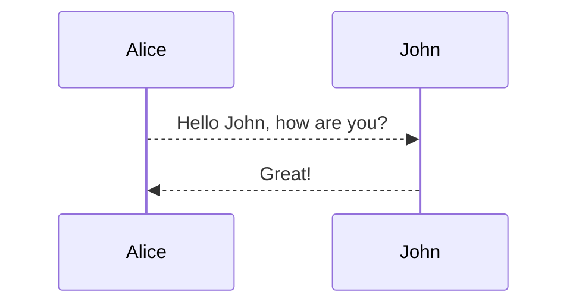

**Table of contents**

*TOC
{:toc}

### Hyperlink

```
[Reliable-ing](https://mazhuang.org)

<https://mazhuang.org>
```

[Reliable-ing](https://mazhuang.org)

<https://mazhuang.org>

### list

```
1. Ordered list item 1

2. Ordered list item 2

3. Ordered list item 3
```

1. Ordered list item 1

2. Ordered list item 2

3. Ordered list item 3

```
* Unordered list item 1

* Unordered list item 2

* Unordered list item 3
```

* Unordered list item 1

* Unordered list item 2

* Unordered list item 3

```
- [x] Task List 1
- [ ] Task List 2
```

- [x] Task List 1
- [ ] Task List 2

### emphasize

```
~~strikethrough~~

**With black**

*italics*
```

~~strikethrough~~

**With black**

*italics*

### Title

```
# Level 1 title
## Second level title
### Level 3 title
#### Level 4 Headings
##### Level 5 Heading
###### Level 6 Heading
```

Tips: There must be a space between `#` and the title.

### sheet

```
| HEADER1 | HEADER2 | HEADER3 | HEADER4 |
| ------- | :------ | :-----: | ------: |
| content | content | content | content |
```

| HEADER1 | HEADER2 | HEADER3 | HEADER4 |
| ------- | :------ | :-----: | ------: |
| content | content | content | content |

1. :----- means left alignment
2. :----: means center alignment
3. -----: Indicates right alignment

### code blocks

```python
print 'Hello, World!'
```

1. list item1

2. list item2

    ```python
    print 'hello'
    ```

### picture

```

```


### Anchor

```
* [directory](#directory)
```

* [directory](#directory)

### Inline Attribute

Span Inline Attribute details refer to <https://kramdown.gettalong.org/syntax.html#span-ials>

Block Inline Attribute details refer to <https://kramdown.gettalong.org/syntax.html#block-ials>

Add class, id, inline styles, etc. to a block/element:

```
{:.center}

Hello, *world*{:#world}

Hello, *world*{: style="color:red"}
```

{:.center}

Hello, *world*{:#world}

Hello, *world*{: style="color:red"}

Combined with custom styles, some scenarios are more useful.

### Emoji

:camel:
:blush:
:smile:

### Footnotes

This is a text with footnote[^1].

###mermaid




### sequence

```sequence
Andrew->China: Says Hello
Note right of China: China thinks\nabout it
China-->Andrew: How are you?
Andrew->>China: I am good thanks!
```

###flowchart

```flow
st=>start: Start
e=>end
op1=>operation: My Operation
sub1=>subroutine: My Subroutine
cond=>condition: Yes
or No?
io=>inputoutput: catch something...

st->op1->cond
cond(yes)->io->e
cond(no)->sub1(right)->op1
```

### mathjax

When $$(a \ne 0)$$, there are two solutions to $$(ax^2 + bx + c = 0)$$ and they are

$$x = {-b \pm \sqrt{b^2-4ac} \over 2a}.$$

### mindmap

```mindmap
# topic
## topic2
### topic2.1
### topic2.2
## topic3
<!--Note-->
this is a note
<!--/Note-->
### topic3.1
### topic3.2
#### topic3.2.1
#### topic3.2.2
#### topic3.2.3
#### topic3.2.4
#### topic3.2.5
### topic3.4
### topic3.5
### topic3.6
```

[^1]: Here is the footnote 1 definition.
